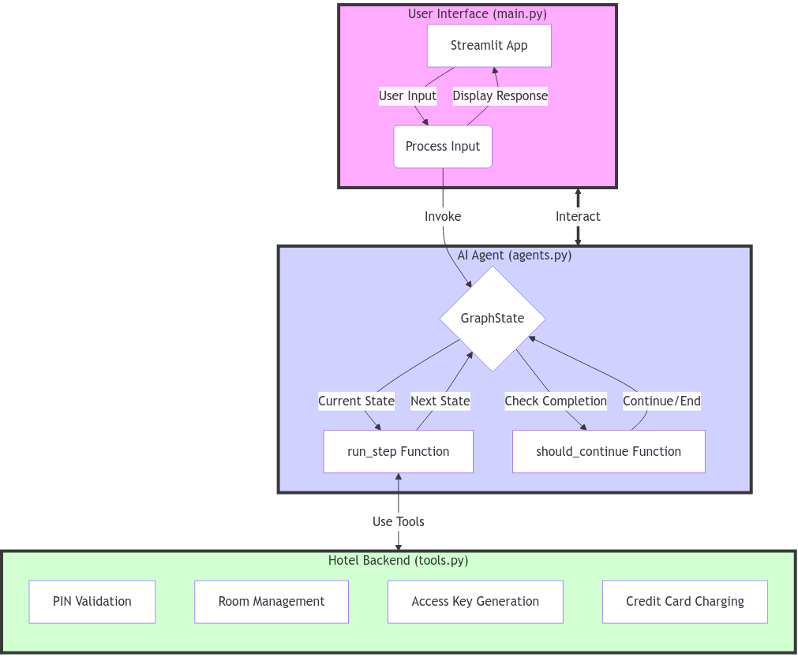

# Let's Build Hotel Check in system using AI Agents

TL;DR
We’re building an AI-powered hotel check-in system. It uses a chat interface to guide guests through check-in, handling PIN verification, room assignment, and payment. This system showcases how AI can streamline hospitality operations, potentially reducing wait times and improving guest experiences.

## Introduction

Picture this: You’ve just arrived at a hotel after a long journey. You’re tired and just want to get to your room. Wouldn’t it be great if you could check in quickly and easily, without waiting in line? That’s exactly what we’re building in this article!

We’re creating an AI-powered hotel check-in system. Our system assumes you’ve already made a reservation, and now you’re ready to check in. It’s designed to make the check-in process smooth and effortless, using a friendly chat interface powered by artificial intelligence.

Full Article : [https://medium.com/ai-advances/lets-build-hotel-check-in-system-using-ai-agents-b195e7da96a1


## What's This Project About

In this article, we’re diving into the world of AI-powered hospitality. We’ll walk you through building a hotel check-in system that uses AI agents to interact with guests. Here’s what we’re covering:

Creating a user-friendly chat interface using Streamlit
Developing an AI agent that handles the check-in process step-by-step
Simulating hotel backend operations like room assignment and payment processing
We’ll look at three main components:

main.py : The chat interface that guests interact with
agents.py : The AI brain that manages the check-in process
tools.py : The simulated hotel backend operations
By the end of this article, you’ll understand how these pieces fit together to create a seamless, AI-driven check-in experience.

## Why Work on It?

AI is revolutionizing the way businesses operate, and the hospitality industry is no exception. This article shows you how to implement AI in a practical, guest-facing application. Here’s why it matters:

Efficiency: AI-powered systems can handle multiple check-ins simultaneously, reducing wait times and improving guest satisfaction.
Consistency: AI agents provide a consistent check-in experience, ensuring every guest receives the same high-quality service.
Availability: Unlike human staff, AI systems can operate 24/7, accommodating guests who arrive at any hour.
Adaptability: AI can easily handle multiple languages and adapt to guest preferences, enhancing the personalized experience.
While our example uses a fictional hotel, the concepts we cover can be applied to real-world hospitality businesses. This article gives you a hands-on look at how AI can transform traditional processes, providing valuable insights for anyone interested in the intersection of AI and customer service.

## Architecture



# Tutorial: Let's Build Hotel Check in system using AI Agents 

## Prerequisites
- Python installed on your system.
- A basic understanding of virtual environments and command-line tools.

## Steps

1. **Virtual Environment Setup:**
   - Create a dedicated virtual environment for our project:
   
     ```bash
     python -m venv Lets-Build-Hotel-Check-in-system-using-AI-Agents
     ```
   - Activate the environment:
   
     - Windows:
       ```bash
       Lets-Build-Hotel-Check-in-system-using-AI-Agents\Scripts\activate
       ```
     - Unix/macOS:
       ```bash
       source Lets-Build-Hotel-Check-in-system-using-AI-Agents/bin/activate
       ```
   
# Installation and Setup Guide

**Install Project Dependencies:**

Follow these steps to set up and run the 'Let's Build Hotel Check in system using AI Agents' project:

1. Navigate to your project directory:
   ```
   cd path/to/your/project
   ```
   This ensures you're in the correct location for the subsequent steps.

2. Install the required dependencies:
   ```
   pip install -r requirements.txt
   ```
   This command installs all the necessary Python packages listed in the requirements.txt file.


## Run - Hands-On Guide: Let's Build Hotel Check in system using AI Agents

   ```bash 
     
      # Run 
      streamlit run main.py
      
   ```

## Conclusion and Next Steps

Congratulations! You've just built Let's Build Hotel Check in system using AI Agents
